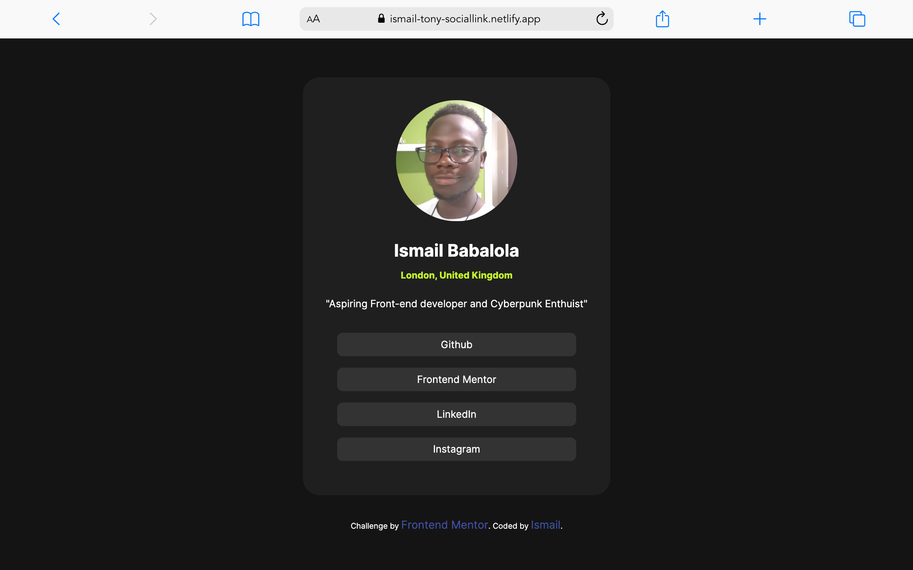

# Frontend Mentor - Social links profile solution

This is a solution to the [Social links profile challenge on Frontend Mentor](https://www.frontendmentor.io/challenges/social-links-profile-UG32l9m6dQ). Frontend Mentor challenges help you improve your coding skills by building realistic projects.

## Table of contents

- [Overview](#overview)
  - [The challenge](#the-challenge)
  - [Screenshot](#screenshot)
  - [Links](#links)
- [My process](#my-process)
  - [Built with](#built-with)
  - [What I learned](#what-i-learned)
  - [Continued development](#continued-development)
  - [Useful resources](#useful-resources)
- [Author](#author)
- [Acknowledgments](#acknowledgments)

**Note: Delete this note and update the table of contents based on what sections you keep.**

## Overview

### The challenge

Users should be able to:

- See hover and focus states for all interactive elements on the page

### Screenshot



### Links

- Solution URL: [Github Repository](https://github.com/Ismail-tony/socialLink)
- Live Site URL: [Netlify](https://ismail-tony-sociallink.netlify.app/)

## My process

### Built with

- HTML
- CSS

### What I learned

Setting the body font-size to 62.5% approximately equals to 10px, so i can use the font-size of the h1 to 1.4em which will set the h1 font to 14px because 10px x 1.4em = 14px.

To see how you can add code snippets, see below:

```css
body {
  font-size: 62.5%;
}

h1 {
  font-size: 1.4em;
}
```

If you want more help with writing markdown, we'd recommend checking out [The Markdown Guide](https://www.markdownguide.org/) to learn more.

### Useful resources

- [Kevin Powell - Are you using the right CSS units?](https://www.youtube.com/watch?v=N5wpD9Ov_To&t=144s) - This helped me in understanding how to use a proper responsive meaqsurement in css. This is also a great resource to go back to when i don't remember it.

## Author

- Frontend Mentor - [@ismail-tony](https://www.frontendmentor.io/profile/ismail-tony)
- Instagram - [@ismail_tony](https://www.instagram.com/ismail_tony/)
